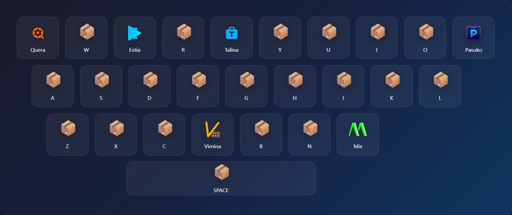

# Talina
<p align="center">  </p><p align="center"> <strong>轻量美观的工具快速启动面板</strong> </p><p align="center">   </p>


## ✨ 简介
- 基于WebView2的Windows工具快速启动面板，追求极致的轻量与高效。通过全局热键一键唤出，点击或按下快捷键即可瞬间启动，让你的桌面告别杂乱的快捷方式。


## 🖼️ 截图
<p align="center">  </p>


## 🚀 功能特性

### 🎨 可视化工具面板
- 精美的网格布局展示所有工具
- 支持自定义图标
- 悬停动画效果，交互体验流畅

### 📐 灵活的布局系统
- 自动网格模式：工具按顺序自动排列，零配置即可使用
- 指定位置模式：通过 col/row 精确控制每个工具在网格中的位置
- 绝对定位模式：通过 x/y/w/h 像素级自由摆放，打造个性化面板
- 支持跨行跨列，大小自由组合
- 占位符控制留白与间距

### ⌨️ 快捷键操作

> [!TIP]
> |快捷键|功能|
> |---|---|
> |Ctrl + Enter|呼出/隐藏窗口|
> |A-Z / 0-9 / F1-F12|	通过快捷键启动工具|
> |SPACE / ENTER / TAB / ESC|更多的快捷键|

### 📌 系统托盘
- 最小化后自动收入系统托盘
- 右键快速启动工具、编辑配置

- ### 🪶 轻量高效
- 失焦自动隐藏，不打断工作流程
- 单实例运行，不重复占用资源


## 📦 安装与使用

### 系统要求
- 操作系统：Windows 10 / 11
- 运行时：Microsoft Edge WebView2 Runtime

### 快速开始

1. 从 Releases 页面下载最新版本
2. 解压到任意目录
3. 运行 Talina.exe
4. 按下 Ctrl + Enter 唤出工具面板

### 目录结构

```
Talina/
├── Talina.exe    # 主程序
├── config.ini    # 配置文件
└── icons/          # 图标目录
    ├── Talina.png
    └── ...
```


## ⚙️ 配置说明

配置文件为程序目录下的 config.ini，使用 INI 格式

### 窗口设置

```
[window]
[window]
width = 600                      # 窗口宽度（像素）
height = 500                     # 窗口高度（像素）
columns = 4                      # 网格列数
rows = 0                            # 网格行数（0 = 自动）
gap = 20                            # 网格间距（像素）
padding = 20                    # 容器内边距（像素）
# itemWidth = 100           # 项目宽度（可选）
# itemHeight = 100         # 项目高度（可选）
background = #1a1a2e    # 背景色（CSS 颜色值）
backgroundGradient = linear-gradient(135deg, #1a1a2e 0%, #16213e 50%, #0f3460 100%)
```

> [!NOTE]
> backgroundGradient 优先级高于 background，设置渐变后将忽略纯色背景

### 工具配置

```
[tool]
name = Notepad
path = notepad.exe
key = N

[tool]
name = VSCode
path = C:\Users\admin\AppData\Local\Programs\Microsoft VS Code\Code.exe
icon = .\icon\vscode.png
key = V

[tool]
name = Terminal
path = ~\AppData\Local\Microsoft\WindowsApps\wt.exe
icon = .\icon\terminal.png
key = T

[tool]
name = Tool
path = .\tools\mytool.exe
icon = .\icon\mytool.png
key = F1
```

工具字段说明：

|字段|是否必填|说明|
|---|---|---|
|name|是|显示名称|
|path|是|文件路径|
|icon|否|图标路径|
|key|否|快捷键|
|col|否|网格列位置|
|row|否|网格行位置|
|width|否|跨列数(默认1)|
|height|否|跨行数(默认1)|
|x|否|绝对定位X坐标|
|y|否|绝对定位Y坐标|
|w|否|绝对定位宽度|
|h|否|绝对定位高度|

支持的快捷键：

A-Z、0-9、F1-F12、SPACE、ENTER、TAB、ESC

### 路径写法

```
# 绝对路径
path = C:\Program Files\App\app.exe

# 用户目录
path = ~\AppData\Local\Programs\App\app.exe

# 相对路径
path = .\tools\mytool.exe
path = tools\mytool.exe

# UNC 网络路径
path = \\server\share\tool.exe
```

> [!TIP]
> icon 的路径规则与 path 完全相同

### 占位符

```
# 不可见占位符(默认)
[placeholder]

# 可见占位符(显示虚线边框)
[placeholder]
visible = true
background = rgba(255,255,255,0.05)

# spacer 是 placeholder 的别名
[spacer]
```

|字段|默认值|说明|
|---|---|---|
|visible|false|是否显示虚线边框|
|background|空|背景色|
|col / row / width / height|-|网格定位|
|x / y / w / h|-|绝对定位|


## 📐 布局模式详解

### 模式一：自动网格(默认)

不设置 col / row，工具按配置文件中的顺序自动排列：

```
[window]
columns = 3

[tool]
name = 工具A
path = a.exe

[tool]
name = 工具B
path = b.exe

[tool]
name = 工具C
path = c.exe
```

### 模式二：指定网格位置

通过 col / row 精确控制位置，width / height 控制跨越：

```
[window]
columns = 4
rows = 3

[tool]
name = tool1
path = tool1.exe
col = 1
row = 1
width = 2
height = 2

[tool]
name = tool2
path = tool2.exe
col = 3
row = 1

[placeholder]
col = 4
row = 1
```

### 模式三：绝对定位

任意一个项目设置了 x 属性，所有项目自动切换为绝对定位模式：

```
[tool]
name = toola
path = toola.exe
x = 20
y = 20
w = 120
h = 100

[tool]
name = toolb
path = toolb.exe
x = 160
y = 20
w = 120
h = 100
```

> [!WARNING]
> 绝对定位模式下，未设置 x 属性的项目将不会显示


## 📋 配置示例

```
[window]
width = 600
height = 450
columns = 4
rows = 0
gap = 20
padding = 20
backgroundGradient = linear-gradient(135deg, #1a1a2e 0%, #16213e 50%, #0f3460 100%)

[tool]
name = Notepad
path = notepad.exe
key = N

[tool]
name = Terminal
path = ~\AppData\Local\Microsoft\WindowsApps\wt.exe
icon = .\icons\terminal.png
key = T

[tool]
name = VS Code
path = C:\Users\xxx\AppData\Local\Programs\Microsoft VS Code\Code.exe
icon = .\icons\vscode.png
key = V
```


## 🛠️ 技术特点
- 基于 Chromium WebView2 渲染引擎，布局保留了css风味
- 图标自动转 Base64 内嵌，无外部资源依赖
- 失焦自动隐藏，不打断工作流程
- 支持 高 DPI 显示器适配
- 单实例运行保护，防止重复启动


## ❓ 常见问题

### Q: 全局热键冲突怎么办？

当前全局热键固定为 Ctrl + Enter，如与其他软件冲突，请关闭冲突软件或修改其热键设置
tip:先用着Quera，等更新

### Q: 如何添加自定义图标？

在程序目录下创建 icons 文件夹，放入图标文件，然后在配置中引用：

```
icon = .\icons\myapp.png
```

支持格式：png、jpg、ico、svg、gif、bmp。未配置图标的工具会显示默认的 📦 图标

### Q: 修改配置后如何生效？

右键托盘图标 → 编辑配置，修改保存后重启程序

### Q: ~ 路径代表什么？

当前 Windows 用户的主目录，例如 C:\Users\xxx

```
# 以下两种写法等价：
path = ~\Desktop\tool.exe
path = C:\Users\xxx\Desktop\tool.exe
```

### Q: 面板自动消失了？

这是设计行为——窗口失焦后会自动隐藏。按 Ctrl + Enter 或点击托盘图标即可重新唤出

---
<p align="center"> Made with 💚 by Talina </p>
